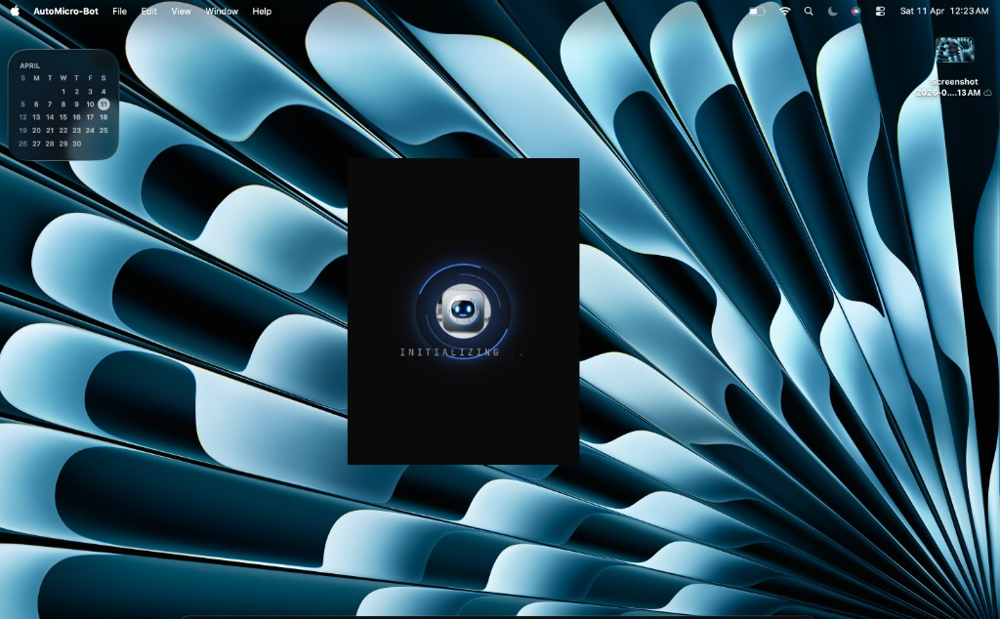
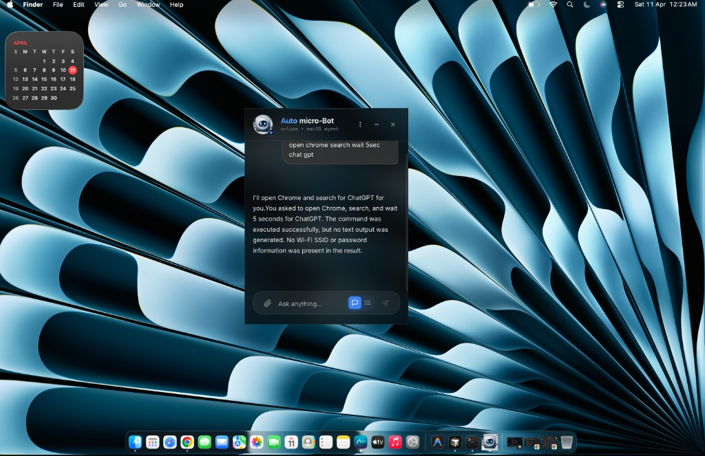
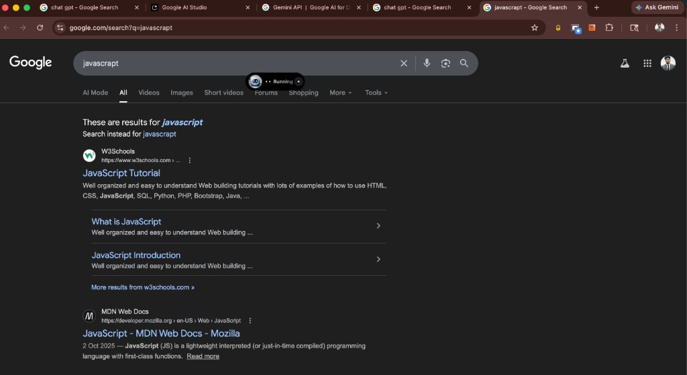
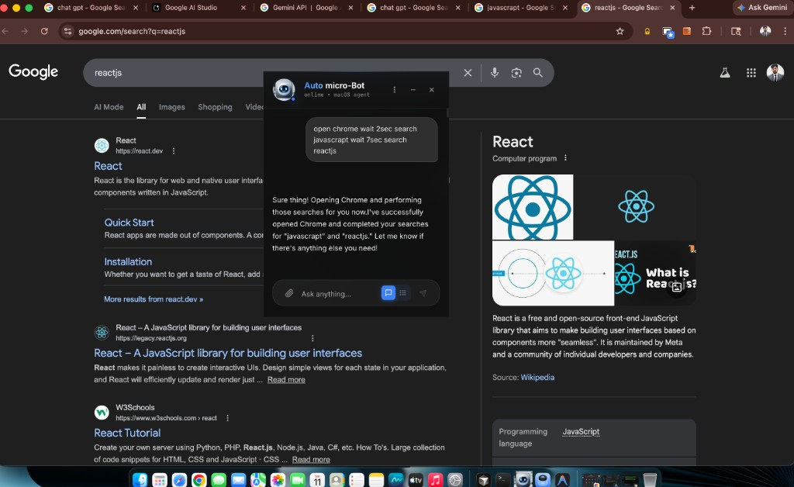
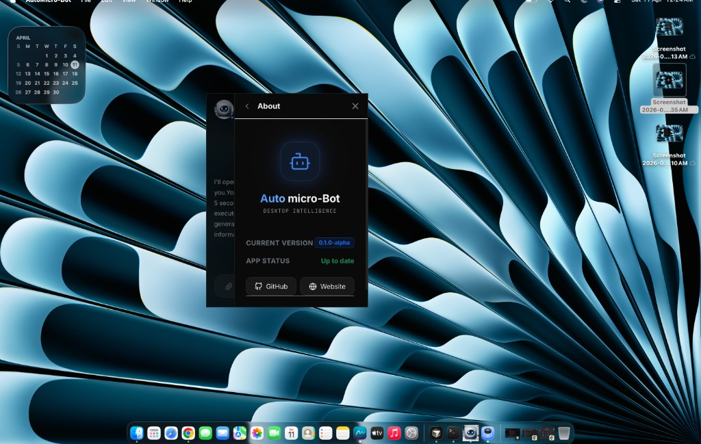
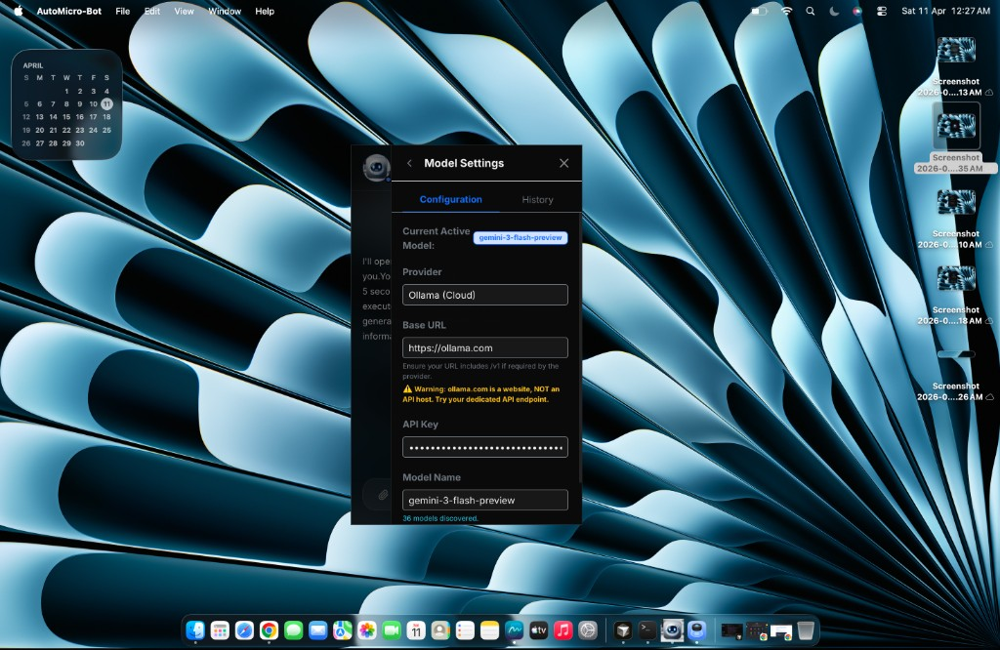
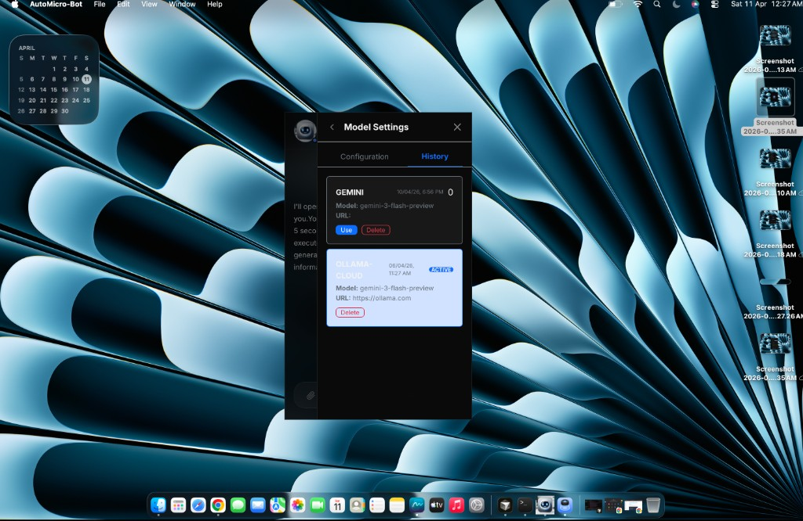

# AutoMicro-Bot

**AutoMicro-Bot** is a floating **macOS desktop agent**: a glass-style chat window that stays on top of your workspace so you can steer the system in plain English—open apps, drive the browser, run multi-step flows, and get streamed answers from your chosen LLM.

The app pairs a **Tauri + React** front end with a **Python** backend (**FastAPI**, **LangGraph**, **SQLite**). Model calls can go through **Ollama** or other providers you configure in-app.

---

## What it does

- **Natural-language macOS automation** — e.g. open Chrome, search, wait between steps, chain queries (`javascript` then `reactjs`).
- **Floating chat UI** — compact, dark-friendly interface with streaming-style feedback.
- **Settings** — tool permissions, model settings, appearance (e.g. dark mode), optional humanoid chat agent.
- **Model configuration** — pick provider, base URL, API key, and model name; keep a **history** of setups and switch active configs.
- **Local-first** — backend and memory can run on your machine; you control which models and endpoints to use.

---

## Tech stack

| Layer | Technologies |
|--------|----------------|
| Desktop UI | Tauri 2, React 19, Vite, Tailwind-style UI |
| Backend | Python, FastAPI, LangGraph / LangChain |
| Data | SQLite chat history |
| LLM | Ollama and other providers (configured in Model Settings) |

---

## Screenshots

### Coverflow-style gallery (3D scroll)

GitHub’s README renderer **does not allow** the CSS and JavaScript needed for a real coverflow (3D `transform`, `perspective`, scroll-linked tilt, reflections). Those features only run in a normal browser page.

**Interactive coverflow (like your reference):** open **[`docs/coverflow-gallery.html`](docs/coverflow-gallery.html)** locally after cloning (`open docs/coverflow-gallery.html` on macOS), or publish the **`/docs`** folder with [GitHub Pages](https://docs.github.com/en/pages/getting-started-with-github-pages/configuring-a-publishing-source-for-your-github-pages-site) and visit:

`https://<your-username>.github.io/<your-repo>/coverflow-gallery.html`

That page uses **scroll-snap**, **perspective** on the scene, **rotateY / scale** driven by horizontal scroll, and **`-webkit-box-reflect`** for the glossy reflection under each shot.

### Static gallery (in this README)

In order—scroll the README to browse.

#### 1. Startup splash



#### 2. Chat — browser automation



#### 3. Demo — Google search for “javascript”



#### 4. Demo — chained search (“javascript” then “reactjs”)



#### 5. Settings


#### 6. About



#### 7. Model Settings — configuration



#### 8. Model Settings — history



---

## Setup (developers)

Detailed install and run steps for the backend and Tauri app live in **[`auto-bot/README.md`](auto-bot/README.md)** (Node, Python/Poetry, Rust, Ollama).

```bash
# Backend (from auto-bot/back-end)
poetry install && cp .env.example .env
poetry run start

# Desktop app (from auto-bot/front-end)
npm install
npm run tauri:dev
```

---

## Repository layout

```text
AutoMicro-bot/
├── docs/
│   ├── coverflow-gallery.html # Browser-only 3D coverflow over readme-screenshots
│   └── readme-screenshots/    # Images used by this README + gallery
├── auto-bot/
│   ├── front-end/             # Tauri + React
│   └── back-end/              # FastAPI + LangGraph
└── README.md                  # This file
```

---

## License

Add a `LICENSE` file in the repo root when you are ready to publish.
