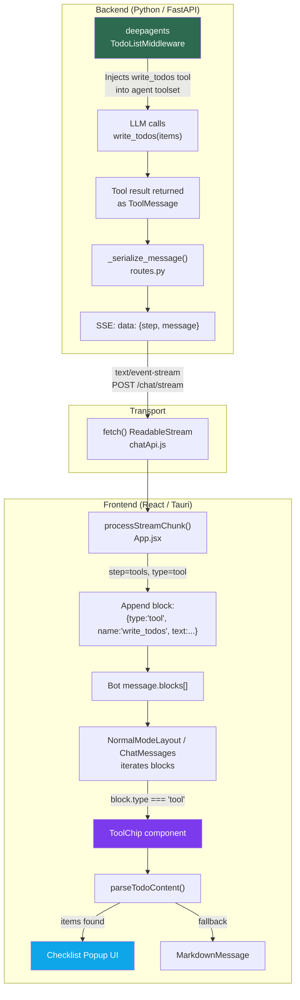

# Todo System — Deep Architecture

> A full vertical trace of how the **Todo** feature works in Rie-AI, from the LLM middleware layer through the streaming API to the frontend UI.

---

## Table of Contents

1. [Overview](#overview)
2. [Architecture Diagram](#architecture-diagram)
3. [Layer 1 — TodoListMiddleware (Backend)](#layer-1--todolistmiddleware-backend)
4. [Layer 2 — Agent Initialization & Mode Gating](#layer-2--agent-initialization--mode-gating)
5. [Layer 3 — SSE Streaming Pipeline (Backend → Frontend)](#layer-3--sse-streaming-pipeline-backend--frontend)
6. [Layer 4 — Frontend SSE Consumer (App.jsx)](#layer-4--frontend-sse-consumer-appjsx)
7. [Layer 5 — Block-Based Message Model](#layer-5--block-based-message-model)
8. [Layer 6 — ToolChip Component (Rendering)](#layer-6--toolchip-component-rendering)
9. [Layer 7 — Todo Parser (`parseTodoContent`)](#layer-7--todo-parser-parsetodocontent)
10. [Layer 8 — Checklist Popup UI](#layer-8--checklist-popup-ui)
11. [Wire Format Examples](#wire-format-examples)
12. [Design Decisions & Notes](#design-decisions--notes)
13. [File Reference Index](#file-reference-index)

---

## Overview

The Todo system gives Rie's AI agent a **planning mechanism**. Before the agent starts executing a complex task, it can call a `write_todos` tool to create a structured task list. This list is:

- **Created by the LLM** — not the user
- **Streamed in real-time** via SSE to the frontend
- **Rendered as a visual checklist** inside the chat bubble
- **Updated by the LLM** — the agent calls `write_todos` again with updated statuses as it completes tasks
- **Display-only on the frontend** — the user cannot toggle items; only the agent updates them

```
┌─────────────────────────────────────────────────────────┐
│  "Thinking Mode" only — skipped entirely in Flash Mode  │
└─────────────────────────────────────────────────────────┘
```

---

## Architecture Diagram



---

## Layer 1 — TodoListMiddleware (Backend)

### Source

- **Package**: `deepagents` (v0.3.0+) — see [pyproject.toml](file:///e:/code/Personal/Rie-AI/app/Rie-be/pyproject.toml)
- **Import**: [agent.py:L21](file:///e:/code/Personal/Rie-AI/app/Rie-be/app/agent.py#L21)

```python
from langchain.agents.middleware import TodoListMiddleware, ...
```

### What it does

`TodoListMiddleware` is a **LangGraph middleware** from the `deepagents` library. When added to the agent's middleware stack, it:

1. **Injects a `write_todos` tool** into the agent's available tool set at graph-compile time
2. **Augments the system prompt** with a configurable instruction telling the LLM to use the tool for planning
3. The LLM can then call `write_todos` with a **list of items**, each having:
   - `content` (string) — description of the task
   - `status` (string) — `"pending"` or `"completed"`
4. When the agent calls the tool, the middleware processes it and returns a `ToolMessage` back into the conversation, which becomes part of the stream

### Configuration

```python
TodoListMiddleware(
    system_prompt="Use the write_todos tool to plan your tasks"
)
```

The `system_prompt` parameter is appended to the agent's instructions. This is the only configuration knob exposed.

---

## Layer 2 — Agent Initialization & Mode Gating

### Source

- [agent.py:L560-L575](file:///e:/code/Personal/Rie-AI/app/Rie-be/app/agent.py#L560-L575)

### Conditional Activation

The Todo middleware is **only active in "thinking" mode**. Rie has two speed modes:

| Speed Mode  | TodoListMiddleware | Behavior |
|-------------|-------------------|----------|
| `thinking`  | ✅ Enabled         | Agent plans before acting — creates todo list |
| `flash`     | ❌ Skipped         | Agent acts immediately — no planning overhead |

```python
# Core middleware stack
middleware_stack = []

# Only add TodoListMiddleware in thinking mode (skip for flash)
if effective_speed_mode != "flash":
    middleware_stack.append(
        TodoListMiddleware(
            system_prompt="Use the write_todos tool to plan your tasks"
        )
    )
```

### Middleware Stack Position

`TodoListMiddleware` is the **first middleware** in the stack (position 0), before:
1. `SubAgentMiddleware` (agent mode only)
2. `SummarizationMiddleware` (always)
3. `HumanInTheLoopMiddleware` (if HITL enabled)

This ordering means the todo planning happens at the outermost layer, wrapping all subsequent agent behavior.

---

## Layer 3 — SSE Streaming Pipeline (Backend → Frontend)

### Source

- [routes.py:L621-L774](file:///e:/code/Personal/Rie-AI/app/Rie-be/app/routes.py#L621-L774) — `_agent_stream_generator()`
- [routes.py:L565-L618](file:///e:/code/Personal/Rie-AI/app/Rie-be/app/routes.py#L565-L618) — `_serialize_message()`

### How `write_todos` output enters the stream

When the LLM calls `write_todos`, LangGraph produces a chunk like:

```python
{
    "tools": {
        "messages": [
            ToolMessage(
                content="[{'content': 'Analyze the codebase', 'status': 'pending'}, ...]",
                name="write_todos",
                ...
            )
        ]
    }
}
```

The streaming pipeline processes this as:

1. **`_agent_stream_generator`** iterates over `agent_manager.stream()` chunks
2. For each chunk, it extracts the `step` key (e.g., `"tools"`) and the `messages` list
3. It takes the **last message** from the list and passes it to `_serialize_message()`
4. `_serialize_message()` extracts `type`, `role`, `name`, `content`, and `tool_calls`

### Serialization

```python
def _serialize_message(msg):
    data = {}
    for attr in ("type", "role", "name", "id"):
        if hasattr(msg, attr):
            data[attr] = getattr(msg, attr)
    if hasattr(msg, "content"):
        data["content"] = getattr(msg, "content")
    # ... tool_calls handling ...
    return data
```

For a `write_todos` ToolMessage, the serialized output looks like:

```json
{
  "type": "tool",
  "name": "write_todos",
  "content": "[{'content': 'Analyze codebase', 'status': 'pending'}, {'content': 'Write tests', 'status': 'pending'}]"
}
```

> [!NOTE]
> The `content` is a **string** — not parsed JSON. It's the raw Python `repr()` of the list. This is why the frontend parser must handle both JSON and Python-style syntax.

### SSE Wire Format

The final SSE event sent to the client:

```
data: {"step": "tools", "message": {"type": "tool", "name": "write_todos", "content": "[{'content': '...', 'status': '...'}]"}}
```

---

## Layer 4 — Frontend SSE Consumer (App.jsx)

### Source

- [App.jsx:L403-L458](file:///e:/code/Personal/Rie-AI/app/Rie-tauri/src/App.jsx#L403-L458) — tool output handling in `processStreamChunk`
- [chatApi.js:L156-L222](file:///e:/code/Personal/Rie-AI/app/Rie-tauri/src/services/chatApi.js#L156-L222) — `streamChat()` SSE reader

### SSE Reading (chatApi.js)

```javascript
const reader = response.body.getReader();
const decoder = new TextDecoder();
let buffer = "";

while (true) {
  const { value, done } = await reader.read();
  if (done) break;
  buffer += decoder.decode(value, { stream: true });
  const lines = buffer.split("\n\n");
  buffer = lines.pop(); // Keep incomplete line in buffer

  for (const line of lines) {
    if (line.startsWith("data: ")) {
      const data = JSON.parse(line.substring(6));
      onChunk(data);  // → processStreamChunk()
    }
  }
}
```

### Tool Output Processing (App.jsx)

When `processStreamChunk` receives a tool message:

```javascript
if (step === "tools" || msg.type === "tool" || msg.role === "tool") {
  const content = msg.content;
  if (content && typeof content === "string") {
    const toolName = msg.name || currentTool;

    // Append tool output as a block in the bot message
    setSessions((prev) => {
      // ... find bot message by ID ...
      return {
        ...m,
        blocks: [...blocks, { type: "tool", name: toolName, text: content }],
      };
    });
  }
}
```

This adds a new **block** to the bot message's `blocks` array:

```javascript
{
  type: "tool",
  name: "write_todos",
  text: "[{'content': 'Analyze codebase', 'status': 'pending'}, ...]"
}
```

---

## Layer 5 — Block-Based Message Model

### Structure

Bot messages in Rie use a **block-based model** rather than a single string. Each message has a `blocks` array containing interleaved text and tool outputs:

```javascript
{
  id: 1712345678901,
  from: "bot",
  blocks: [
    { type: "text", text: "Let me plan this out..." },
    { type: "tool", name: "write_todos", text: "[...]" },     // ← Todo list
    { type: "text", text: "Starting with step 1..." },
    { type: "tool", name: "read_file", text: "..." },
    { type: "tool", name: "write_todos", text: "[...]" },     // ← Updated todos
    { type: "text", text: "All done! ✅" }
  ]
}
```

### Rendering Pipeline

Both `NormalModeLayout` and `ChatMessages` (floating mode) iterate over `blocks`:

```jsx
{(m.blocks || [{ type: 'text', text: m.text }]).map((block, idx) => (
  <div key={idx}>
    {block.type === 'text' ? (
      <MarkdownMessage content={block.text} />
    ) : (
      <ToolChip name={block.name} content={block.text} />
    )}
  </div>
))}
```

Any block with `type !== "text"` is routed to `ToolChip`.

---

## Layer 6 — ToolChip Component (Rendering)

### Source

- [ToolChip.jsx](file:///e:/code/Personal/Rie-AI/app/Rie-tauri/src/components/ToolChip.jsx) (163 lines)

### Detection Logic

```javascript
const isWriteTodos = name && (
  name.toLowerCase() === "write_todos" || 
  name.toLowerCase() === "write todos"
);
const todoItems = isWriteTodos ? parseTodoContent(content) : null;
```

The component handles two name formats because the tool name can arrive with either underscores or spaces depending on how the middleware serializes it.

### Two Rendering Paths

```
ToolChip receives (name, content)
    │
    ├── name is "write_todos"?
    │       ├── YES → parseTodoContent(content)
    │       │       ├── items found → Render Checklist UI
    │       │       └── parse failed → Render MarkdownMessage fallback
    │       │
    │       └── NO → Render MarkdownMessage (generic tool output)
```

### Base Chip (Always Visible)

Every tool call renders a small label:

```
WRITE TODOS  ⓘ
```

The tool name is formatted: split by `_`, capitalize each word, join with spaces, uppercase.

### Hover Popup

On mouse hover (with 120ms debounce), a popup appears showing either the todo checklist or generic markdown content.

---

## Layer 7 — Todo Parser (`parseTodoContent`)

### Source

- [ToolChip.jsx:L9-L48](file:///e:/code/Personal/Rie-AI/app/Rie-tauri/src/components/ToolChip.jsx#L9-L48)

### Why a Custom Parser?

The `write_todos` tool returns its content as a **Python repr string**, not valid JSON. The content can look like:

```python
# Python-style (common)
[{'content': 'Analyze codebase', 'status': 'pending'}, {'content': 'Write tests', 'status': 'completed'}]

# JSON-style (less common)
[{"content": "Analyze codebase", "status": "pending"}]
```

### Parsing Strategy (2-pass)

```
Input: raw string from tool content
    │
    ├── Step 1: Extract [...] list pattern via regex
    │
    ├── Step 2: Try JSON parse (after replacing ' → ")
    │       ├── Success → map to {content, status} items
    │       └── Failure → fall through
    │
    ├── Step 3: Regex fallback for Python-style dicts
    │       Pattern: /'content':\s*'((?:[^'\\]|\\.)*)'\s*,\s*'status':\s*'([^']*)'/g
    │       ├── Matches found → return items
    │       └── No matches → return null
    │
    └── null → ToolChip falls back to MarkdownMessage
```

### Code Walkthrough

```javascript
function parseTodoContent(raw) {
  if (!raw || typeof raw !== "string") return null;
  const str = raw.trim();

  // 1. Find the list pattern [...]
  const listMatch = str.match(/\[[\s\S]*\]/);
  if (listMatch) {
    const listStr = listMatch[0];
    
    // 2. Try JSON (normalize single quotes → double)
    try {
      const jsonStr = listStr.replace(/'/g, '"');
      const list = JSON.parse(jsonStr);
      if (!Array.isArray(list)) return null;
      const items = list
        .map((item) => {
          if (item && typeof item === "object" && "content" in item) {
            return {
              content: typeof item.content === "string" 
                ? item.content : String(item.content),
              status: typeof item.status === "string" 
                ? item.status : (item.status ?? "pending"),
            };
          }
          return null;
        })
        .filter(Boolean);
      if (items.length) return items;
    } catch {
      // fall through to regex
    }

    // 3. Python-style regex fallback
    const re = /'content':\s*'((?:[^'\\]|\\.)*)'\s*,\s*'status':\s*'([^']*)'/g;
    const items = [];
    let m;
    while ((m = re.exec(listStr)) !== null) {
      items.push({
        content: m[1].replace(/\\./g, (c) => c === "\\'" ? "'" : c),
        status: m[2] || "pending",
      });
    }
    if (items.length) return items;
  }

  return null;
}
```

> [!WARNING]
> The JSON parse path does a naive `replace(/'/g, '"')` which can break if content strings contain apostrophes (e.g. `"don't"`). The regex fallback handles escaped quotes correctly via `(?:[^'\\]|\\.)*`.

---

## Layer 8 — Checklist Popup UI

### Visual Structure

```
┌──────────────────────────────────────┐
│  ☰  To-dos 4                        │  ← Header with count
│──────────────────────────────────────│
│  ⊘  Analyze the existing codebase   │  ← pending (circle-X)
│  ⊘  Identify affected components    │  ← pending
│  ⊘  Write unit tests                │  ← pending
│  ✓  Set up project structure        │  ← completed (circle-✓)
└──────────────────────────────────────┘
```

### Status Icons

| Status | Icon | SVG |
|--------|------|-----|
| `"completed"` | ✅ Circle with checkmark | `<circle cx="12" cy="12" r="10"/><path d="M8 12l3 3 5-6"/>` |
| anything else | ❌ Circle with X | `<circle cx="12" cy="12" r="10"/><line x1="15" y1="9" x2="9" y2="15"/><line x1="9" y1="9" x2="15" y2="15"/>` |

### Animation

The popup uses **Framer Motion** `AnimatePresence`:

```javascript
initial={{ opacity: 0, y: -4, scale: 0.96 }}
animate={{ opacity: 1, y: 0, scale: 1 }}
exit={{ opacity: 0, y: -4, scale: 0.96 }}
transition={{ duration: 0.15 }}
```

### Styling

- Dark theme: `bg-neutral-900`, `border-neutral-700`
- Max dimensions: `min-w-[200px] max-w-[320px] max-h-48`
- Scrollable content: `overflow-y-auto custom-scrollbar`
- Item text: `text-[11px] text-neutral-500/90`

---

## Wire Format Examples

### Initial Plan (all pending)

```
SSE:
data: {"step":"tools","message":{"type":"tool","name":"write_todos","content":"[{'content': 'Read the project README', 'status': 'pending'}, {'content': 'Analyze src/ directory', 'status': 'pending'}, {'content': 'Review dependencies', 'status': 'pending'}]"}}

Parsed items:
[
  { content: "Read the project README",  status: "pending" },
  { content: "Analyze src/ directory",   status: "pending" },
  { content: "Review dependencies",      status: "pending" }
]
```

### Progress Update (some completed)

```
SSE:
data: {"step":"tools","message":{"type":"tool","name":"write_todos","content":"[{'content': 'Read the project README', 'status': 'completed'}, {'content': 'Analyze src/ directory', 'status': 'completed'}, {'content': 'Review dependencies', 'status': 'pending'}]"}}

Parsed items:
[
  { content: "Read the project README",  status: "completed" },
  { content: "Analyze src/ directory",   status: "completed" },
  { content: "Review dependencies",      status: "pending" }
]
```

---

## Design Decisions & Notes

### Why display-only?

The todos are **not interactive** — users cannot click to toggle status. This is intentional:

1. Todos represent the **agent's internal plan**, not a user task list
2. The agent manages its own progress by calling `write_todos` again with updated statuses
3. Making them interactive would require a bidirectional sync mechanism between the frontend and the agent's internal state, adding significant complexity

### Why support both JSON and Python syntax?

The `deepagents` library's `TodoListMiddleware` returns tool results as Python `repr()` strings. Different LLM providers may format the output differently:

- **Groq/Llama** models tend to produce Python-style dicts with single quotes
- **OpenAI/Gemini** models may produce valid JSON with double quotes
- The parser must handle both reliably

### Why is it a middleware, not a regular tool?

Using middleware instead of a standalone tool provides several advantages:

1. **Automatic injection** — no need to manually add the tool to every agent configuration
2. **System prompt augmentation** — the middleware can extend the prompt without modifying the core SYSTEM_PROMPT
3. **State management** — middleware can maintain its own internal state across turns without polluting the agent's tool definitions

### Why skip in Flash mode?

Flash mode is designed for **instant responses** without planning overhead. The todo list adds latency (an extra LLM tool call + round trip) and is unnecessary for simple queries where the agent can respond directly.

---

## File Reference Index

| Layer | File | Key Lines | Purpose |
|-------|------|-----------|---------|
| Middleware | [agent.py](file:///e:/code/Personal/Rie-AI/app/Rie-be/app/agent.py) | L21, L566-L575 | Import & conditional activation of TodoListMiddleware |
| Dependencies | [pyproject.toml](file:///e:/code/Personal/Rie-AI/app/Rie-be/pyproject.toml) | L12 | `deepagents ^0.3.0` dependency |
| Serialization | [routes.py](file:///e:/code/Personal/Rie-AI/app/Rie-be/app/routes.py) | L565-L618 | `_serialize_message()` — converts ToolMessage to JSON |
| SSE Stream | [routes.py](file:///e:/code/Personal/Rie-AI/app/Rie-be/app/routes.py) | L621-L774 | `_agent_stream_generator()` — produces SSE events |
| API Client | [chatApi.js](file:///e:/code/Personal/Rie-AI/app/Rie-tauri/src/services/chatApi.js) | L156-L222 | `streamChat()` — SSE reader with buffer handling |
| Stream Consumer | [App.jsx](file:///e:/code/Personal/Rie-AI/app/Rie-tauri/src/App.jsx) | L229-L463 | `processStreamChunk()` — routes tool outputs to blocks |
| Block Renderer (Normal) | [NormalModeLayout.jsx](file:///e:/code/Personal/Rie-AI/app/Rie-tauri/src/components/NormalModeLayout.jsx) | L390-L405 | Iterates `blocks[]`, routes to ToolChip |
| Block Renderer (Float) | [ChatMessages.jsx](file:///e:/code/Personal/Rie-AI/app/Rie-tauri/src/components/ChatMessages.jsx) | L83-L98 | Same block iteration for floating mode |
| ToolChip | [ToolChip.jsx](file:///e:/code/Personal/Rie-AI/app/Rie-tauri/src/components/ToolChip.jsx) | L50-L163 | Detection, parsing, and rendering |
| Parser | [ToolChip.jsx](file:///e:/code/Personal/Rie-AI/app/Rie-tauri/src/components/ToolChip.jsx) | L9-L48 | `parseTodoContent()` — dual-format parser |
